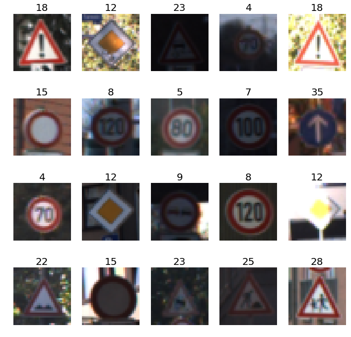
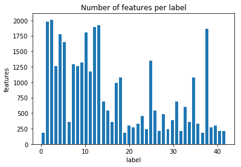
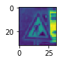

# **Traffic Sign Recognition** 

## Classifying Traffic sign using Convolution Neural networks

**Build a Traffic Sign Recognition Project**

The goals / steps of this project are the following:
* Load the data set (see below for links to the project data set)
* Explore, summarize and visualize the data set
* Design, train and test a model architecture
* Use the model to make predictions on new images
* Analyze the softmax probabilities of the new images
* Summarize the results with a written report

You're reading it! and here is a link to my [Traffic Sign Classifier](https://github.com/dimonge/Traffic-Sign-Classifier/blob/master/Traffic_Sign_Classifier.ipynb)

### Data Set Summary & Exploration

I used the numpy library to calculate summary statistics of the traffic
signs data set:

* The size of training set is 34799
* The size of the validation set is 4410
* The size of test set is 12630
* The shape of a traffic sign image is (32, 32, 3)
* The number of unique classes/labels in the data set is 43

#### Exploratory visualization of the dataset.

Here is an exploratory visualization of the data set. The following table shows images of signs with their respective label value.

This helps to better understand the corresponding image with the label. The histogram below shows the amount of features per label in the training set. 

#### Design and Test a Model Architecture

##### Preprocessing

First Step, I converted the color images (depth = 3) to grayscale image (depth = 1). Here is an example of a traffic sign image before and after grayscaling.

After that, I normalized the image data so that the image has a small mean value to improved the network performance on the dataset.

##### Model Architecture

My final model consisted of the following layers:

| Layer         		|     Description	        					| 
|:---------------------:|:---------------------------------------------:| 
| Input         		| 32x32x1   							| 
| 1st Convolution 3x3   | 1x1 stride, same padding, outputs 28x28x6 	|
| RELU					|												|
| Max pooling	      	| 2x2 stride,  outputs 14x14x6 					|
| 2nd Convolution 3x3	| 1x1 stride, same padding, outputs 10x10x16    |
| Max pooling	      	| 2x2 stride,  outputs 5x5x16 				    |
| 3rd Convolution 3x3	| 1x1 stride, same padding, outputs 1x1x400     |
| 1st Flatten (2nd Conv) 	| outputs 400 	 	   	 	   	 	   	 	|
| 2nd Flatten (3rd Conv)  	| outputs 400 	 	   	 	   	 	   	 	|
| Sum (1st Flatten & 2nd Flatten | outputs 800  						|
|	Dropout		        |  Output 800									|
|	Full Connected      | Output 43										|
|						|												|
 
#### Model Training

To train the model, I used the following parameters
Optimizer = AdamOptimizer
Batch size = 128
Number of Epochs = 10
Learning rate = 0.001
mean = 0
stddev = 0.1
keep_prob = 0.5

#### Describe the approach taken for finding a solution and getting the validation set accuracy to be at least 0.93. Include in the discussion the results on the training, validation and test sets and where in the code these were calculated. Your approach may have been an iterative process, in which case, outline the steps you took to get to the final solution and why you chose those steps. Perhaps your solution involved an already well known implementation or architecture. In this case, discuss why you think the architecture is suitable for the current problem.

#### Solution Approach
I tried the following approach 
1. Using the same LeNet architecture from the example, I got 90% accuracy. I changed the following hyper parameters
  Depth = 1
  Output = 43
* Applied Dropout (0.5) to the first Fully Connected layer, I got 94% accuracy. Using the same params
* Applied two dropout after the 1 and 2 second Fully Connected layer. I got 94.1% accuracy. 
* Reducing the learning rate to 0.005 got 90% accuracy
* Increasing the learning rate to 0.05 got 92% accuracy
* Increasing the learning rate to 0.0075 got 89.1% accuracy

My final model results were:
* validation set accuracy of 94.6%
* test set accuracy of 92.3%

### Test a Model on New Images

#### Choose five German traffic signs found on the web and provide them in the report. For each image, discuss what quality or qualities might be difficult to classify.

Here are five German traffic signs that I found on the web:

![alt text][image4] ![alt text][image5] ![alt text][image6] 
![alt text][image7] ![alt text][image8]

The first image might be difficult to classify because ...

####2. Discuss the model's predictions on these new traffic signs and compare the results to predicting on the test set. At a minimum, discuss what the predictions were, the accuracy on these new predictions, and compare the accuracy to the accuracy on the test set (OPTIONAL: Discuss the results in more detail as described in the "Stand Out Suggestions" part of the rubric).

Here are the results of the prediction:

| Image			        |     Prediction	        					| 
|:---------------------:|:---------------------------------------------:| 
| Stop Sign      		| Stop sign   									| 
| U-turn     			| U-turn 										|
| Yield					| Yield											|
| 100 km/h	      		| Bumpy Road					 				|
| Slippery Road			| Slippery Road      							|

The model was able to correctly guess 4 of the 5 traffic signs, which gives an accuracy of 80%. This compares favorably to the accuracy on the test set of ...

####3. Describe how certain the model is when predicting on each of the five new images by looking at the softmax probabilities for each prediction. Provide the top 5 softmax probabilities for each image along with the sign type of each probability. (OPTIONAL: as described in the "Stand Out Suggestions" part of the rubric, visualizations can also be provided such as bar charts)

The code for making predictions on my final model is located in the 11th cell of the Ipython notebook.

For the first image, the model is relatively sure that this is a stop sign (probability of 0.6), and the image does contain a stop sign. The top five soft max probabilities were

| Probability         	|     Prediction	        					| 
|:---------------------:|:---------------------------------------------:| 
| .60         			| Stop sign   									| 
| .20     				| U-turn 										|
| .05					| Yield											|
| .04	      			| Bumpy Road					 				|
| .01				    | Slippery Road      							|

For the second image ... 

### (Optional) Visualizing the Neural Network (See Step 4 of the Ipython notebook for more details)
####1. Discuss the visual output of your trained network's feature maps. What characteristics did the neural network use to make classifications?

